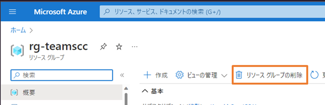

# Azure Communication Service

このリポジトリは、Azure Communication Services を体験するためのラボになります。以下の 2 つのラボが含まれています。

## ラボ 01: Azure Communication Services を作成して体験をする

想定実施時間: 20 分

Azure Communication Services のリソースを Azure 上に作成してサンプル アプリケーションのデプロイを行います。
プログラミングなどは行わないため、Azure サブスクリプションがあれば実施可能です。

[ラボ 01](./contents/lab01/README.md)

## ラボ 02: Azure Communication Services の UI ライブラリを使用したアプリを作る

Azure Communication Services の UI ライブラリを使用して通話やチャットが出来るアプリケーションの作成を行います。

このハンズオンを実施するには以下の環境が必用になります。

- Node.js v16(LTS)
  - https://nodejs.org/ja/
- Visual Studio Code
  - https://azure.microsoft.com/ja-jp/products/visual-studio-code/
  - Visual Studio Code 以外のエディターでも実施可能ですが、その場合は適宜読み替えを行ってください。
- Azure サブスクリプション
  - Azure Communication Services を作成していること
  - ラボ 01 から実施している場合はラボ 01 で作成した Azure Communication Services をそのまま利用してください

[ラボ 02](./contents/lab02/README.md)

## リソースの削除

Azure ポータルにサインインをして今回作成したリソースグループを選択してリソースグループの削除を選択して画面の指示に従いリソースグループを削除してください。

リソースグループ削除時にリソースグループの中のリソースも全て削除されて課金も行われなくなります。

## ラボ完了後

今回のラボで作成したサンプル アプリケーションは、クライアント サイドで Azure Communication Services のキー情報を保持しています。
このキーは漏洩すると第三者に Azure Communication Services を使用されてしまうため、本番環境ではこの構成を取らないでください。
本番利用のアプリケーションでは、キー情報はサーバー サイドで保持をしてユーザー ID やトークンの発行はサーバー サイドで行うように設計をしてください。

認証で保護された API でのユーザー ID の生成やトークンの発行のサンプルが以下のサイトにあるので参考にしてください。
こちらのサンプルでは [Microsoft Graph API の拡張機能](https://learn.microsoft.com/ja-jp/graph/extensibility-overview)を使用して Azure Communication Services のユーザー ID を格納しています。

[信頼された認証サービスのヒーロー サンプルの使用を開始する](https://learn.microsoft.com/ja-jp/azure/communication-services/samples/trusted-auth-sample?pivots=programming-language-javascript)

