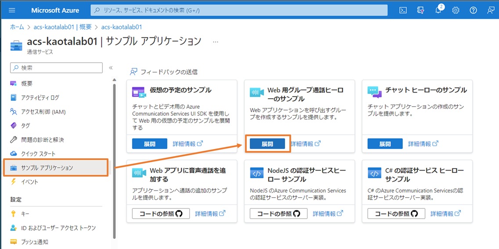
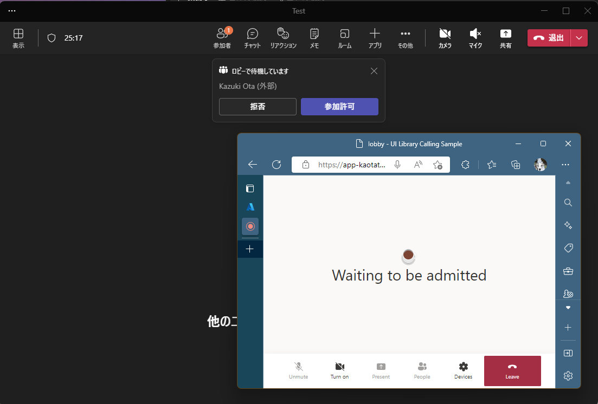

# ラボ 01: Azure Communication Services を作成して体験をする

ここでは、Azure ポータルで Azure Communication Services のリソースを作成してサンプル アプリケーションをデプロイして Azure Communication Services の機能を体験します。

デプロイするサンプルアプリケーションは以下のようなグループ通話が可能なアプリケーションになります。

## Azure Communication Services のリソースの作成とサンプル アプリのデプロイ

1. [Azure ポータル](https://portal.azure.com) を開いてサインインを行います。
2. Azure ポータルの「リソースの作成」を選択します。
   
   
3. 検索ボックスに Communication と入力して、選択肢に出てくる Communication Services を選択します。
   
   
4. Communication Services の作成画面に移動するので「作成」を選択します。

   
5. 以下のように各種パラメーターを入力して「レビューと作成」を選択します。
   - サブスクリプション: デプロイ先のサブスクリプションを選択
   - リソース グループ: 任意の名前で新規作成
   - リソース グループの位置情報: (Asia Pacific) Japan East
   - リソース名: 任意の名前 (グローバルで一意である必要があります)
   - データの場所: Japan

     
6. 入力内容の確認画面になるので内容を確認して「作成」を選択します。2 分程度でデプロイが完了します。
   
   
7. デプロイの完了後に「リソースに移動」を選択してリソースを開きます。

   
8. 「サンプル アプリケーション」を選択してWeb 用グループ通話ヒーローのサンプルの「展開」ボタンを選択します。

   
9. 以下の内容を入力して「確認と作成」を選択します。
   - サブスクリプション: Azure Communication Services をデプロイしたサブスクリプションが選択されていることを確認
   - リソース グループ: Azure Communication Services をデプロイしたリソース グループが選択されていることを確認
   - リージョン: Azure Communication Services をデプロイしたリソース グループのリージョンが選択されていることを確認
   - App Name: 任意の名前を入力 (グローバルで一意の名前にする必用があります)
   - Sku: F1 になっていることを確認

     
10. 確認と作成を押すと検証が行われます。検証が完了後に表示される画面で「作成」を選択してデプロイを実行します。通常 1 ～ 2 分程度でデプロイが完了します。

    
11. 「リソース グループに移動」を選択してデプロイ先のリソース グループを表示します。

    
12. リソース グループにデプロイされているリソースの種類が App Service になっているものを探してリソース名を選択してリソースを開きます。

    
13. App Service を開くと URL が表示されているのでリンクをクリックしてアプリケーションを開きます。

    
14. 以下のような画面が表示されればデプロイは成功です。
    
    

## デプロイされたアプリケーションの動作確認

### グループ通話

1. Start a call を選択して Display name に名前を入力して Next を選択します。
   
   
2. マイクやカメラの使用の許可を求めるポップアップが表示されるので許可を選択してください。
   
   
3. **マイクがミュートになっていること**を確認して「Start call」を選択してください。
   マイクがオンになっているとハウリングなどが発生するため注意してください。
   
   
4. 以下のようにグループ通話の画面が表示されます。ブラウザーの URL をクリップボードにコピーしてください。
   
   
5. 新しいブラウザー ウィンドウを起動して上でコピーをした URL を開きます。
6. 以下のような画面が表示されるので Display name を入力して Next を選択します。
   
   
7. デバイスへのアクセス許可が求められるので許可を選択してブラウザーからマイクやカメラなどが使えるようにします。
   
   
8. マイクがミュートになっていることを確認して「Start call」を選択します。
   
   
9. 2 つのブラウザーからグループ通話に参加できていることを確認します。Present から画面共有を行うことやカメラをオンにすることも可能です。マイクをオンにする場合は、必ずループが起こらないようにするため出力先のスピーカーはイヤフォンなどにして確認してください。

   
10. 動作が確認できたら、Leave ボタンを選択して会議から抜けてブラウザーを閉じてください。

### Teams 会議への参加 (オプション)

このサンプル アプリは Teams に外部ユーザーとして参加することが出来ます。以下の手順で確認が出来ます。

1. Microsoft Teams 会議を Teams や Outlook を使用して作成します。
2. 作成した Teams 会議のリンクを取得します。以下のような会議予定にある会議に参加するためのリンクを Azure Communication Services から参加できる会議のリンクとして使用できます。
   
   

   または、Teams のカレンダーから会議の詳細を開いて「リンクのコピー」から取得することも出来ます。

   
3. Teams を使って作成した Teams 会議に参加します。**参加の際にマイクはミュートにしてください。**
4. アプリケーションの URL を開いて Join a Teams meeting を選択して Teams 会議のリンクと Display name を入力して Next を選択してください。
   
   
5. マイクがミュートになっていることを確認して Start call を選択してください。
   
   
6. サンプル アプリが会議参加前の表示になり、Teams にはロビーに待機しているユーザーがいることが表示されます。
   
   
7. Teams で「参加許可」を選択すると会議に参加できます。画面共有などを利用できることを確認してください。
8. 会議を終了してブラウザーなどのウィンドウを閉じてください。

