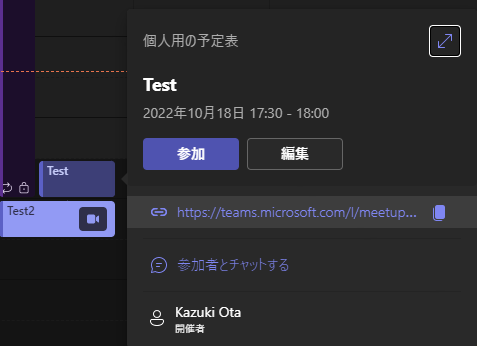

# ラボ 02: Azure Communication Services の UI ライブラリを使用したアプリを作る

Azure Communication Services の UI ライブラリを使用して通話やチャットが出来るアプリケーションの作成を行います。

このハンズオンを実施するには以下の環境が必用になります。

- Node.js v16(LTS)
  - https://nodejs.org/ja/
- Visual Studio Code
  - https://azure.microsoft.com/ja-jp/products/visual-studio-code/
  - Visual Studio Code 以外のエディターでも実施可能ですが、適宜読み替えを行ってください。
- Azure サブスクリプション
  - Azure Communication Services を作成していること
  - ラボ 01 から実施している場合はラボ 01 で作成した Azure Communication Services をそのまま利用してください

## 作成するアプリケーション

Azure Communication Services の UI ライブラリを行いグループ通話や Teams 会議に参加して通話やチャットなどが出来るアプリケーションを作成します。

グループ通話や会議の情報を入力する画面


グループ通話を行う画面


ハンズオンを簡単にするため、全ての動作をクライアント サイドで行うように実装しています。本番のアプリケーションでは、Azure Communication Services のキーを使うような操作はサーバーサイドで行い、そのエンドポイントは認証で保護を行ってください。

## React のプロジェクトの作成と動作確認

1. コマンドプロンプトや PowerShell などを開いて作業用のフォルダーに移動します。ここでは `c:\labs` というフォルダーを使用します。それ以外のフォルダーを使用する場合は適宜読み替えを行ってください。
2. 以下のコマンドを実行して React のアプリケーションを作成します。
   
   ```
   npx create-react-app acs-sample-app --template typescript
   ```
3. 作成が完了したら以下コマンドを実行してアプリケーションのフォルダーに移動して Visual Studio Code でフォルダーを開きます。code にパスが通っていない場合は Visual Studio Code を起動して `c:\labs\asc-sample-app` フォルダーを開いてください。
   
   ```
   cd acs-sample-app
   code .
   ```
4. Visual Studio Code のターミナルで `npm start` を実行して以下のように React のアプリケーションがブラウザーで開かれることを確認してください。
   
   

   画面が表示されたら Visual Studio Code のターミナルで Ctrl + C を押して開発サーバーを停止してください。

## React のバージョンを 17 にダウングレードする

このハンズオン ラボで使用する Azure Communication Services の UI ライブラリは 2022/10/18 時点では最新の React v18 には対応していません。create-react-app コマンドで作成されるアプリケーションは v18 が利用されているため v17 にダウングレードをする必要があります。この問題は以下の GitHub の Issue で管理されています。次のバージョンの UI ライブラリで React v18 でも利用可能になる予定です。

[Support React 18](https://github.com/Azure/communication-ui-library/issues/1900)

1. 以下のコマンドを実行して依存関係を v17 のものに変更します。
   ```
   npm install --save react@17.0.2 react-dom@17.0.2 @testing-library/react@12.1.5
   ```
2. src/index.tsx を開き以下の内容で置き換えて保存します。
   ```ts
   import React from "react";
   import ReactDOM from "react-dom";
   import "./index.css";
   import App from "./App";
   import reportWebVitals from "./reportWebVitals";
   
   ReactDOM.render(
     <React.StrictMode>
       <App />
     </React.StrictMode>,
     document.getElementById("root")
   );
   
   // If you want to start measuring performance in your app, pass a function
   // to log results (for example: reportWebVitals(console.log))
   // or send to an analytics endpoint. Learn more: https://bit.ly/CRA-vitals
   reportWebVitals();
   ```
3. `npm start` を実行してビルド エラーが発生せずに React のアプリが起動することを確認してください。

以上で React v17 へのダウングレードの手順は終了です。

## Azure Communication Services のライブラリの追加

1. 以下のコマンドを実行してライブラリをプロジェクトに追加してください。1行ずつ実行をおこないエラーが発生していないことを確認しながら実行をしてください。警告はいくつか発生しますがエラーが発生していなければ大丈夫です。
   ```
   npm install @azure/communication-react --legacy-peer-deps
   npm install @azure/communication-calling@1.4.4 --legacy-peer-deps
   npm install @azure/communication-chat@1.2.0 --legacy-peer-deps
   npm install @azure/communication-identity --legacy-peer-deps
   ```
   
   参考: 問題ない場合の出力例
   ```
   > npm install @azure/communication-react --legacy-peer-deps
   npm WARN config global `--global`, `--local` are deprecated. Use `--location=global` instead.
   npm WARN deprecated uuid@3.4.0: Please upgrade  to version 7 or higher.  Older versions may use Math.random() in certain circumstances, which is known to be problematic.  See https://v8.dev/blog/math-random for details.  
   
   added 116 packages, and audited 1546 packages in 41s
   
   217 packages are looking for funding
     run `npm fund` for details
   
   6 high severity vulnerabilities
   
   To address all issues (including breaking changes), run:
     npm audit fix --force
   
   Run `npm audit` for details.
   ```

> **Note** ソースコードを記載する上での注意点
> 
> コード内で `useState` や `fromFlatCommunicationIdentifier` などの各種関数などを使用する場合には基本的に事前に `import` が必用になります。この `import` は Visual Studio Code などのプログラムを書くことを前提としてエディタの多くでは自動的に補間する機能を持っています。`import` がされていない機能の場合は、関数名などを入力して `Ctrl + Space` をすることで以下のように `import` を追加する選択肢が表示されます。
> 
> 
> 
> 一部、表示されないものもありますが、そのようなものに関しては手順のなかで `import` を追加するように記載していますが、そうでない場合はエディタの自動入力によって `import` をすることを想定しているため手順内に明示していないので注意してください。
> 
> 以下のように名前がみつからないエラーが表示される場合は上記手順で `import` を追加するかタイプミスをしていないか確認してください。
> 
> 

## 会議へ参加するための情報の作成画面を作る

今回作成するアプリケーションは、Azure Communication Services のユーザー ID の作成やトークンの取得、チャットスレッドの作成から参加者の追加までをクライアント サイドで制御を行うアプリケーションになります。

チャット付きの会議に参加するための UI として `CallWithChatComposite` というコンポーネントを使用します。このコンポーネントは `AzureCommunicationCallWithChatAdapterArgs` という以下のように定義されている型を使って会議に参加して通話したりチャットをしたりすることが出来る完全な UI を持ったコンポーネントになります。

```ts
export declare type AzureCommunicationCallWithChatAdapterArgs = {
    endpoint: string;
    userId: CommunicationUserIdentifier;
    displayName: string;
    credential: CommunicationTokenCredential;
    locator: CallAndChatLocator | TeamsMeetingLinkLocator;
};
```

### 全体の大枠を作成する

まず `AzureCommunicationCallWithChatAdapterArgs` を作るために必用な情報を設定するための画面と通話を行うための画面を出しわける大枠を src/App.tsx に作成します。

src/App.tsx を開いて内容を以下のように変更します。

```ts
import { useState } from 'react';
import './App.css';
import {
  AzureCommunicationCallWithChatAdapterArgs,
  COMPONENT_LOCALE_JA_JP,
  darkTheme,
  FluentThemeProvider,
  LocalizationProvider
} from '@azure/communication-react';

function App() {
  const [callWithCahtAdapterArgs, setCallWithChatAdapterArgs] = useState<AzureCommunicationCallWithChatAdapterArgs>();

  const callWithChat = () => {
    return <div>ここに CallWithChatComposite を使った画面を定義する</div>;
  }

  const setup = () => {
    return <div>ここに AzureCommunicationCallWithChatAdapterArgs を作るための情報を入力する画面を定義する</div>;
  }

  return (
    <div className="content">
      <FluentThemeProvider>
        <LocalizationProvider locale={COMPONENT_LOCALE_JA_JP}>
          {!!callWithCahtAdapterArgs ? callWithChat() : setup()}
        </LocalizationProvider>
      </FluentThemeProvider>
    </div>
  );
}

export default App;
```

画面いっぱいにコンテンツを表示するために src/App.css を開いて以下の内容に変更します。

```css
.content {
  width: 100vw;
  height: 100vh;
}
```

`AzureCommunicationCallWithChatAdapterArgs` の有無で表示画面を変更しています。

> **Note**
> 
> `FluentThemeProvider` は fluent-ui のコンポーネントのテーマを決めるためのコンポーネントです。ここでは上記コードではデフォルト値を使用しているためライトテーマになります。パラメーターに `fluentTheme={darkTheme}` を指定することでダークテーマにすることも可能です。

> **Note**
> 
> `LocalizationProvider` は Azure Communication Services の UI ライブラリの表示言語を切り替えるためのコンポーネントです。上記のコードのように `locale={COMPONENT_LOCALE_JA_JP}' を指定することで日本語表示にすることが出来ます。指定しない場合は英語表記になります。

`npm start` をして画面を表示すると以下のようになります。


### Azure Communication Services のキーの設定

Azure Communication Services にアクセスするために必要なキーの情報をポータルから取得します。Azure ポータルの Azure Communication Services のリソースのキーを開いてエンドポイントと接続文字列をコピーします。


.env.local というファイルをアプリのルートフォルダー (ここの手順と同じパスに作成している場合は c:\labs\acs-sample-app) に作成して以下の内容に編集してください。

```
REACT_APP_ACS_ENDPOINT=先ほどコピーしたエンドポイントの値
REACT_APP_ACS_CONNECTION_STRING=先ほどコピーした接続文字列の値
```

### 会議へ参加するための情報を入力するためのコンポーネントの定義

src/components/AcsSetup.tsx というファイルと src/components/AcsSetup.css というファイルを作成します。

#### ユーザー ID とアクセス トークンの取得

まず、Azure Communication Services のユーザー ID とアクセス トークンを取得する処理を作成します。

ユーザー ID とトークンを取得するには `CommunicationIdentityClient` クラスを Azure Communication Services の接続文字列を使って作成を行い `createUserAndToken` メソッドを使うことで行えます。引数には `['chat', 'voip']` のようにスコープを指定します。

src/components/AcsSetup.tsx を開いて以下のように変更します。

```tsx
import { CommunicationIdentityClient } from "@azure/communication-identity";
import { AzureCommunicationCallWithChatAdapterArgs } from "@azure/communication-react";
import { useEffect, useState } from "react";
import { AzureCommunicationTokenCredential } from "@azure/communication-common";
import "./AcsSetup.css";

type AcsSetupProperties = {
    // この画面で作成した AzureCommunicationCallWithChatAdapterArgs を渡すためのコールバック
    setCallWithChatAdapterArgs: (arg: AzureCommunicationCallWithChatAdapterArgs) => void,
}

function AcsSetup({ setCallWithChatAdapterArgs }: AcsSetupProperties) {
    // ユーザー ID とトークン
    const [userId, setUserId] = useState('');
    const [token, setToken] = useState('');
    // 後で使用するクレデンシャル
    const [credential, setCredential] = useState<AzureCommunicationTokenCredential>();

    useEffect(() => {
        // ユーザー ID とトークンの取得
        (async () => {
            const client = new CommunicationIdentityClient(process.env.REACT_APP_ACS_CONNECTION_STRING!);
            const { user: { communicationUserId }, token } = await client.createUserAndToken(['chat', 'voip']);
            setUserId(communicationUserId);
            setToken(token);
            setCredential(new AzureCommunicationTokenCredential(token));
        })();
    }, []);

    return (
        <div className="container">
            <h3>Azure Communication Services の情報設定</h3>
            <label>ユーザー ID</label>
            <span className="wrap-text">{userId ?? 'ユーザー ID を取得中'}</span>
            <label>トークン</label>
            <span className="wrap-text">{token ?? 'トークンを取得中'}</span>
        </div>
    );
}

export default AcsSetup;
```

src/components/AcsSetup.css を開いて以下のように変更します。

```css
.container {
    min-height: 100vh;
    max-width: 100vw;
    display: flex;
    flex-direction: column;
    align-items: center;
}

.container > form {
    flex: 1;
    display: flex;
    flex-direction: column;
    flex-wrap: wrap;
    word-wrap: break-word;
    overflow-wrap: break-word;
    align-items: center;
    width: 90vw;
}

.container label {
    display: block;
    font-weight: bold;
}

.container .wrap-text {
    overflow-wrap: break-word;
    max-width: 100%;
}
```

そして src/App.tsx を開いて 18 行目にある setup の定義を変更して作成した AcsSetup コンポーネントを表示するように変更します。

```tsx
  const setup = () => {
    return <AcsSetup setCallWithChatAdapterArgs={setCallWithChatAdapterArgs} />;
  }
```

この状態で実行すると、以下のように Azure Communication Service のユーザー ID とトークンが取得され画面に表示されます。


ターミナルで `Ctrl + C` を押して開発用サーバーを停止してください。
#### 表示名の設定

グループ通話や Teams 会議に参加する際の表示名を設定できるようにします。表示名を保存しておくための `displayName` という変数を `useState` を使用して追加します。
src/components/AcsSetup.tsx の `AcsSetup` 関数の先頭の `useState` の最後に以下の 1 行を追加します。

```tsx
// 表示名
const [displayName, setDisplayName] useState('');
```

画面作成に使用するコンポーネントを `import` で追加します。ファイルの先頭の `import` 文に以下の 1 行を追加してください。

```tsx
import { DefaultButton, PrimaryButton, TextField } from "@fluentui/react";
```

そして `AcsSetup` の `return` 文に `form` や表示名の入力用の `TextField` を追加します。`return` 文の手前に `form` の `onSubmit` 用の関数も追加して `return` 文を以下のように変更します。

```tsx
const submit = (e: FormEvent) => {
    e.preventDefault();
    // 最後に、ここに AzureCommunicationCallWithChatAdapterArgs を作成する処理を追加します。
};

return (
    <div className="container">
        <h3>Azure Communication Services の情報設定</h3>
        <label>ユーザー ID</label>
        <span className="wrap-text">{userId ?? 'ユーザー ID を取得中'}</span>
        <label>トークン</label>
        <span className="wrap-text">{token ?? 'トークンを取得中'}</span>
        <form onSubmit={submit}>
            <TextField
                label="表示名"
                className="input"
                value={displayName}
                onChange={(e, newValue) => setDisplayName(newValue ?? '')} />
        </form>
    </div>
);
```

src/components/AcsSetup.css に以下の定義を追加します。

```css
form .input {
  width: 100%;
}
```

`npm start` を実行して、以下のような画面が表示されることを確認してください。


#### グループ通話の作成

次に、Azure Communication Services のグループ通話とチャット スレッドを作成して参加するユーザーを追加する機能を作成します。Azure Communication Services のグループ通話は会議の ID を知っているユーザーは参加できますが、チャット スレッドはチャット スレッドを作ったユーザー ID のトークンで参加者を指定する必要があります。そのためチャット付きのグループ通話を行う場合はチャット スレッドにグループ通話に参加するユーザーを追加する必要があります。

グループ通話は UUID を指定することで作成が出来ます。UUID を作成するために [uuid](https://www.npmjs.com/package/uuid) を npm からインストールをします。以下のコマンドを実行してください。

```
npm install uuid --legacy-peer-deps
npm install --save-dev @types/uuid --legacy-peer-deps
```

src/components/AcsSetup.tsx の import に以下の 1 行を追加します。uuid を生成するための機能を追加をしています。

```tsx
import { v4 as uuidv4 } from 'uuid';
```

src/components/AcsSetup.tsx の `AcsSetup` 関数の先頭にある `useState` に以下の定義を追加します。

```tsx
// チャットのトピック
const [topic, setTopic] = useState('');
// チャットのスレッド ID
const [threadId, setThreadId] = useState('');
// グループ通話の ID
const [groupId, setGroupId] = useState('');
```

`form` に入力項目とチャット スレッドを作成するボタンと、作成されたグループ通話の ID やスレッド ID を表示する場所も作成します。`displayName` の `TextField` の下に以下のコードを追加します。

```tsx
<div className="meeting-info">
    <div>
        <h4>新しい会議を作成</h4>
        <TextField
            label="トピック"
            className="input"
            value={topic}
            onChange={(e, newValue) => setTopic(newValue ?? '')} />
        <DefaultButton
            text="会議を作成"
            disabled={!topic || !displayName}
            onClick={() => createGroupMeeting()} />
    </div>
</div>
<div>
    <h4>参加会議情報</h4>
    {!!groupId ? 
        (<>
            <div>グループ ID</div>
            <span className="wrap-text">{groupId}</span>
            <div>チャット スレッド ID</div>
            <span className="wrap-text">{threadId}</span>
        </>) : 
        (<span>参加する会議情報がありません。</span>)}
</div>
```

会議を作成するためのボタンで呼んでいる `createGroupMeeting` 関数を以下の内容で `submit` 関数の前に追加します。

```tsx
const createGroupMeeting = async () => {
    // 必用な情報がそろっていない場合は何もしない
    if (!credential) return;
    if (!userId) return;
    if (!displayName) return;
    if (!topic) return;

    const client = new ChatClient(process.env.REACT_APP_ACS_ENDPOINT!, credential);
    // トピックを指定して、参加者が自分のみのチャットスレッドを作成
    const result = await client.createChatThread(
        { topic, },
        {
            participants: [
                { id: fromFlatCommunicationIdentifier(userId), displayName },
            ]
        },
    );

    // チャットスレッドが作成できたらグループIDや作成されたスレッドIDを設定
    if (!!result.chatThread) {
        setGroupId(uuidv4());
        setThreadId(result.chatThread.id);
    } else {
        setGroupId('');
        setThreadId('');
    }
};
```

ここまでの状態で画面は以下のようになります。表示名とトピックを入力して会議を作成ボタンを押すと以下のようにグループ IDとチャット スレッド ID が表示されます。


続けて、チャット スレッドにユーザーを追加する処理を作成します。会議を作成ボタンの下にチャットスレッドにユーザーを追加するためのユーザー ID の入力欄とボタンを追加します。最初にチャット スレッドに追加するユーザーのユーザー ID を保持するための変数を `AcsSetup` 関数の `useState` を呼び出している箇所に追加します。

```tsx
// チャットスレッドに追加するユーザー ID
const [additionalParticipantUserId, setAdditionalParticipantUserId] = useState('');
```

会議を作成ボタンの下に以下のコードを追加します。

```tsx
<TextField
    label="会議に追加するユーザーの ID"
    value={additionalParticipantUserId}
    onChange={(e, newValue) => setAdditionalParticipantUserId(newValue ?? '')} />
<DefaultButton
    text="ユーザーを追加"
    disabled={!threadId || !additionalParticipantUserId}
    onClick={() => addParticipantToChatThread()} />
```

`submit` 関数の前に `addParticipantToChatThread` 関数を以下のように追加します。

```ts
const addParticipantToChatThread = async () => {
    // 必用な情報がそろっていない場合は何もしない
    if (!credential) return;
    if (!threadId) return;
    if (!additionalParticipantUserId) return;

    // チャットのスレッドにユーザーを追加する
    const client = new ChatClient(process.env.REACT_APP_ACS_ENDPOINT!, credential);
    const chatThreadClient = client.getChatThreadClient(threadId);
    await chatThreadClient.addParticipants({
        participants: [
            { id: fromFlatCommunicationIdentifier(additionalParticipantUserId) },
        ],
    });

    setAdditionalParticipantUserId('');
};
```

この状態で動作させると、会議の作成後にユーザーを追加出来るようになります。追加対象のユーザー ID は、もう 1 つブラウザーを起動して http://localhost:3000 を開いて取得してください。以下の手順で動作確認が行えます。

1. `npm start` をするか、既に開発サーバーが起動している場合は http://localhost:3000 をブラウザーで開く
2. 表示名とトピックを入力して「会議を作成」ボタンを押す
3. 参加会議情報が表示されたのを確認して、別のブラウザーを起動して http://localhost:3000 を開く
4. 新しく開いたブラウザーに表示されたユーザー ID をコピーする
5. 元のブラウザーに戻り会議に追加するユーザーの IDに先ほどコピーしたユーザー ID を張り付ける
6. 「ユーザーを追加」ボタンを押すとユーザーが追加され会議に追加するユーザーの ID が空欄に戻る

#### 既存のグループ通話の情報の設定

ここまでの手順で、新しいグループ通話用の ID とチャット スレッドを作成してチャット スレッドにユーザーを追加しました。ここでは、既存のグループ通話とチャット スレッドに参加するための設定を行う機能を作成します。

既存のグループ通話の ID とチャット スレッド ID を入力するための値を保持する変数を `AcsSetup` 関数の先頭の `useState` を書いている箇所の末尾に以下のコードを追加します。

```tsx
// 既存のグループ通話の ID 入力用
const [groupIdToJoin, setGroupIdToJoin] = useState('');
// 既存のチャット スレッドの ID 入力用
const [threadIdToJoin, setThreadIdToJoin] = useState('');
```

そして `className` が `meeting-info` になっている `div` タグ内に、もう 1 つ `div` タグを追加します。

```tsx
<div>
    <h4>既存の会議情報を入力</h4>
    <TextField
        label="グループ ID または Teams 会議リンク"
        value={groupIdToJoin}
        onChange={(e, newValue) => setGroupIdToJoin(newValue ?? '')} />
    <TextField
        label="チャット スレッド ID"
        value={threadIdToJoin}
        onChange={(e, newValue) => setThreadIdToJoin(newValue ?? '')} />
    <DefaultButton
        text="参加する会議情報を設定"
        disabled={!groupIdToJoin}
        onClick={() => {
            setGroupId(groupIdToJoin);
            setThreadId(threadIdToJoin);
            setGroupIdToJoin('');
            setThreadIdToJoin('');
        }} />                            
</div>
```

見た目を整えるために src/components/AcsSetup.css を開いて以下のスタイルの定義を追加します。

```css
.meeting-info {
    width: 100%;
    display:flex;
    gap: 1rem;
}

.meeting-info > div {
    flex: 1;
    max-width: 50%;
}
```

この状態でアプリケーションを実行して表示すると以下のような見た目になります。既存の会議情報を入力の欄に、別のブラウザーで生成したグループ ID とチャット スレッド ID を入力してボタンを押すことで別のブラウザーで生成した会議の情報を設定することが出来るようになりました。


#### AzureCommunicationCallWithChatAdapterArgs の作成

ここまでの手順で Azure Communication Services 内のグループ通話やチャットに参加するために必用な情報が設定できる画面が出来たので `AzureCommunicationCallWithChatAdapterArgs` を作成する処理を追加します。

`CommunicationUserIdentifier` を `import` するために src/components/AcsSetup.tsx の先頭の `import` 文から `@azure/communication-common` から読み込んでいる箇所を探して以下のように `CommunicationUserIdentifier` を追加してください。

```tsx
import { CommunicationUserIdentifier, AzureCommunicationTokenCredential } from "@azure/communication-common";
```

そして `submit` 関数を以下のように更新します。

```tsx
const submit = (e: FormEvent) => {
    e.preventDefault();
    
    if (!userId) return;
    if (!displayName) return;
    if (!credential) return;
    if (!groupId) return;

    const locator = groupId.startsWith("https://") ?
        // groupId が https:// で始まる場合は Teams 会議リンクとして扱う
        { meetingLink: groupId } as TeamsMeetingLinkLocator :
        // そうじゃない場合は Azure Communication Services の通話とチャットとして扱う
        { callLocator: { groupId }, chatThreadId: threadId } as CallAndChatLocator;
    
    setCallWithChatAdapterArgs({
        endpoint: process.env.REACT_APP_ACS_ENDPOINT!,
        userId: fromFlatCommunicationIdentifier(userId) as CommunicationUserIdentifier,
        displayName,
        credential,
        locator,
    });
};
```

最後に `form` タグの最後に `submit` 用のボタンのタグを以下のように追加します。

```tsx
<PrimaryButton text="会議への参加" type="submit" disabled={!groupId} />
```

この状態で実行をして以下の手順を実行します。

1. 表示名に任意の値を入力する。
2. トピックに任意の値を入力する。
3. 「会議を作成」ボタンを選択する。
4. 参加会議情報に以下のようにグループ IDとチャット スレッド IDが表示されることを確認する。
   
5. 「会議への参加」ボタンを選択する。
6. 画面が切り替わって以下のような表示になることを確認する。
   

### 会議への参加 UI の作成

ここまでの手順でグループ通話やチャットを行うために必用な下準備は完了しました。最後に Azure Communication Services の UI ライブラリを使って会議参加前から会議中の UI を作成します。

src/App.tsx を開いて `callWithChat` 関数を以下の内容で置き換えます。

```tsx
const adapter = useAzureCommunicationCallWithChatAdapter(callWithCahtAdapterArgs ?? {});
const callWithChat = () => {
  if (!!adapter) {
    return <CallWithChatComposite adapter={adapter} />;
  }
  return <h3>初期化中...</h3>;
}
```

`AzureCommunicationCallWithChatAdapterArgs` を元に `useAzureCommunicationCallWithChatAdapter` を使って `adapter` を作成します。この `adapter` を UI ライブラリの `CallWithChatComposite` に渡すことで会議用の UI が表示されます。

### 動作確認

以上でコーディングは完了です。

#### グループ通話の動作確認

Azure Communication Services のグループ通話の動作は以下の手順で確認できます。

1. http://localhost:3000 を 2 つのブラウザーで開いて左右に並べてください
2. 左側のブラウザーで以下の操作を行います
   1. 表示名に「Test user 1」と入力
   2. トピックに「Test 用の会議」と入力
   3. 「会議を作成」ボタンを選択
   4. 以下のような表示になっていることを確認
      
3. 右側のブラウザーで以下の操作を行います
   1. 表示名に「Test user 2」と入力
   2. 既存の会議情報を入力のグループ ID または Teams 会議リンクに左側のブラウザーに表示されているグループ ID を入力
   3. その下のチャット スレッド IDに左側のブラウザーに表示されているチャット スレッド ID を入力
   4. 「参加する会議情報を設定」ボタンを選択
4. 左側のブラウザーで以下の操作を行います
   1. 会議に追加するユーザーの ID に右側のブラウザーに表示されているユーザー ID を入力
   2. 「ユーザーを追加」ボタンを選択して会議に追加するユーザーの ID が消えたことを確認
5. 両方のブラウザーで「会議への参加」ボタンを押して次の画面でデバイスの選択と **マイクをミュート** にして「Start call」ボタンを選択
   - 初めて表示する場合はマイクやカメラへのアクセスが求められるので許可を選択してください
6. グループ通話が開始されるので、チャットや画面共有などが動くことを確認してください
   
7. マイクの動作を確認する場合は、音声の出力はかならずイヤフォンやヘッドフォンで行いハウリングが起きないように注意してください

#### Teams 会議への参加の動作確認 (オプション)

Teams 会議への参加の動作確認は以下の手順で確認できます。

1. テスト用の Teams 会議を Outlook などで作成して Teams 会議のリンクを取得
   - Teams の UI 上から対象の会議上にマウス カーソルを移動させて表示されるポップアップからリンクのコピーが出来ます。
     
     
2. Teams を使ってテスト用の Teams 会議に参加します。ハウリングなどの問題を起こさないためにマイクなどはオフにして参加することをお勧めします。
3. ブラウザーで http://localhost:3000 を開いて作成したアプリケーションの画面を開く
4. 表示名に任意の名前を入力
5. 既存の会議情報を入力のグループ ID または Teams 会議リンクに Teams 会議のリンク URL を入力
6. 「参加する会議情報を設定」ボタンを選択
7. 参加会議情報のグループ ID に Teams 会議のリンクの URL が表示されていることを確認
8. 「会議への参加」ボタンを選択
9. デバイスへのアクセス許可が求められた場合は許可を選択
10. ハウリングなどの問題を避けるためマイクをミュートにしてデバイスの設定を確認
11. 「Start call」ボタンを選択
12. Teams 会議のロビーにアプリケーションで入力した表示名のユーザーが追加されるので許可を行う
    
    
13. チャットや画面共有などの動作確認を行う
    
    
14. マイクの動作確認を行う場合はハウリングなどが起こらないように音声の出力はスピーカーではなくイヤフォンやヘッドフォンなどから行ってください。

